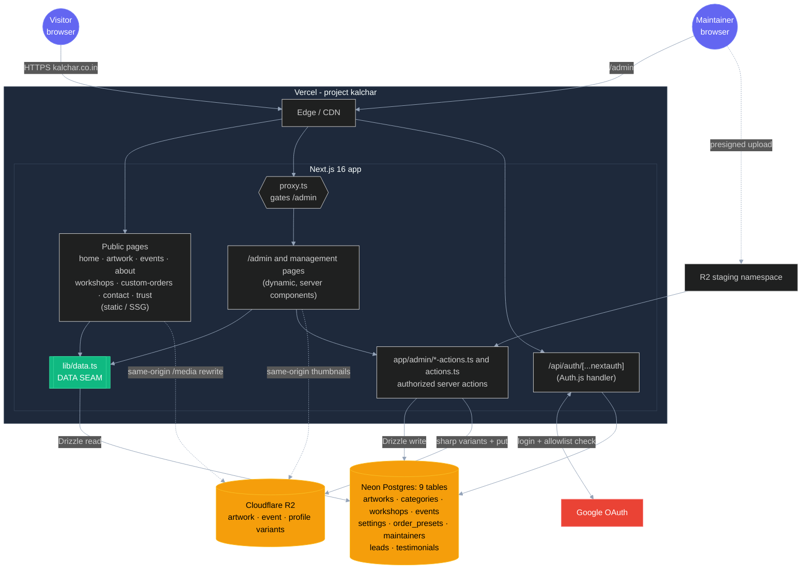
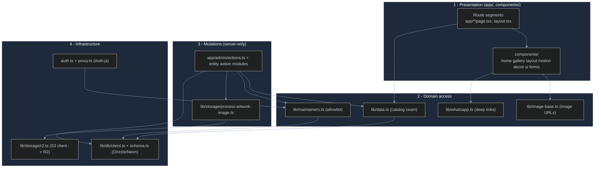
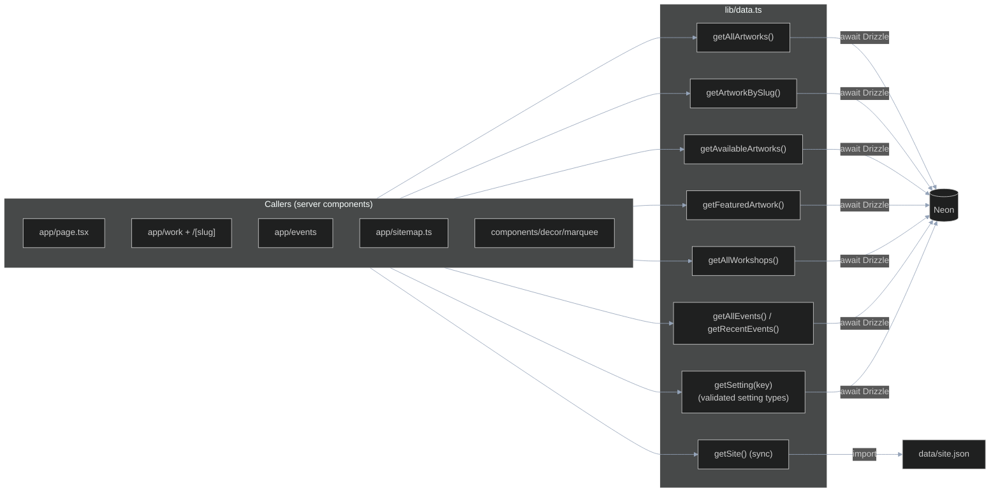

# System Architecture

How [kalchar.co.in](https://kalchar.co.in/) is built and runs. This is the entry point; deeper topics live in [DATABASE.md](DATABASE.md), [AUTH.md](AUTH.md), [IMAGES.md](IMAGES.md), [DEPLOYMENT.md](DEPLOYMENT.md), [DEVELOPMENT.md](DEVELOPMENT.md), and [OPERATIONS.md](OPERATIONS.md).

## Overview

Kalchar is the portfolio + lightweight storefront for folk artist Megha Seth. Visitors browse artwork, see what is available to buy, explore workshops/events, and route purchase or commission intent to WhatsApp. Custom-order briefs can also be saved as private leads. The maintainer panel manages artwork, categories, workshops, events, profile settings, presets, leads, testimonials, and the allowlist. There is no internal payment or checkout service.

It is a single Next.js 16 app, deployed on Vercel. Public pages are static/SSG (pre-rendered from the database at build time, served from the edge); the admin panel and auth endpoints are dynamic (server-rendered on demand). Catalog data lives in Neon Postgres, images in Cloudflare R2, and login is Google OAuth gated to a database allowlist.

## High-level architecture



## Stack

| Concern | Choice | Notes |
| --- | --- | --- |
| Framework | Next.js 16 App Router, React 19 | Hybrid: SSG public, dynamic admin |
| Language | TypeScript (strict) | |
| Styling | Tailwind 4, shadcn-style (cva + Radix) | tokens in `app/globals.css` |
| Animation | Motion 12 + Lenis (lazy) | all reduced-motion safe |
| Hosting | Vercel (`sagar-2` account) | `main` -> prod, `dev` -> preview |
| Database | Neon Postgres + Drizzle ORM | serverless, region in `DATABASE_URL` |
| Image storage | Cloudflare R2 (S3 API) | free egress, public bucket URL |
| Auth | Auth.js v5 + Google OAuth | allowlist in `maintainers` table |
| Tooling | Biome 2, Vitest 4, Playwright 1, pnpm 10, Node 22 | |

## Application layers



| Layer | Responsibility | Key files |
| --- | --- | --- |
| **Presentation** | Routes, React components, all rendering. Public pages are async server components that read the seam; admin pages add client islands for interactivity. | `app/`, `components/` |
| **Domain access** | The read API the UI depends on. `lib/data.ts` is the only place the catalog is read; `getSite()` reads `data/site.json` (static chrome). | `lib/data.ts`, `lib/maintainers.ts`, `lib/image-base.ts`, `lib/whatsapp.ts` |
| **Mutations** | Management writes re-check current membership. The separate public lead action validates visitor input and applies abuse controls. | `app/admin/actions.ts`, `artwork-actions.ts`, `event-actions.ts`, `lead-actions.ts`, `testimonial-actions.ts`, `upload-actions.ts` |
| **Infrastructure** | The external systems: Postgres via Drizzle, R2 via the S3 SDK, Auth.js session/OAuth. | `lib/db/`, `lib/storage/r2.ts`, `auth.ts`, `proxy.ts` |

## The data seam

[lib/data.ts](../lib/data.ts) is the single chokepoint for catalog reads, and the reason swapping the entire backend (JSON files -> Postgres, local images -> R2) touched almost no UI code.



- Catalog getters are **async** and query Neon via Drizzle. Rows are mapped to the UI `Artwork`/`Workshop` types (nullable DB columns -> optional fields; `palette` jsonb -> `string[]`).
- `getSite()` stays **synchronous** -- site brand/nav/contact/section copy is static chrome, read from `data/site.json`, and `app/layout.tsx` consumes it at module top-level where `await` can't reach.
- Public UI reads stay behind this seam. Authorized mutation, allowlist, bootstrap, and migration modules have their own explicit server-side database responsibilities.
- CI's `KALCHAR_TEST_FIXTURES=1` mode supplies public fixture rows at the seam. It rejects `VERCEL=1`, never grants admin access, and throws on database-object use. Real builds use the configured Neon catalog.

See [DATABASE.md](DATABASE.md) for the schema and query details.

## Rendering model

Public pages are **statically generated** -- at build time, `generateStaticParams` and the page bodies call the seam, read Neon, and bake HTML. Visitors hit the Vercel edge cache with no DB round-trip. When a maintainer changes data, the relevant server action calls `revalidatePath` to regenerate the affected pages.

`/admin` and its management pages, login/access-denied, and `/api/auth/*` are dynamic. The proxy routes signed-out visitors to login; current membership is also enforced before private reads and every management mutation. A reusable layout is not the sole authorization boundary.

```text
○  (Static)   /, /about, /contact, /custom-orders, /workshops, /work, /events, /trust, sitemap, catalog.csv
●  (SSG)      /work/[slug]  (one page per artwork slug, from the DB)
ƒ  (Dynamic)  /admin/*, /login, /access-denied, /api/auth/[...nextauth], proxy
```

## Request lifecycles

**Visitor views the gallery** -> edge serves the pre-rendered page -> each artwork `<picture>` uses a same-origin `/media` URL ([lib/image-base.ts](../lib/image-base.ts)) -> the Next rewrite proxies the fixed variant from Cloudflare R2. No database round-trip occurs at request time.

**Maintainer signs in** -> [proxy.ts](../proxy.ts) routes an unauthenticated admin request to login -> Google authenticates through [`/api/auth`](../app/api/auth/[...nextauth]/route.ts) -> the `signIn` callback checks the current allowlist -> private reads and writes re-check current membership. Full sequence in [AUTH.md](AUTH.md).

**Maintainer uploads a piece** -> an authorized upload action issues a staging ticket -> the browser uploads directly to R2 -> [artwork-actions.ts](../app/admin/artwork-actions.ts) re-checks membership and validates the staged image -> the shared processor creates independently owned variants -> the row points at those keys -> public consumers are invalidated. Full pipeline in [IMAGES.md](IMAGES.md).

## Repository map

```text
app/                      routes (public SSG + /admin dynamic + /api/auth)
components/               home/ gallery/ events/ about/ layout/ motion/ decor/ ui/ forms/
auth.ts, proxy.ts         Auth.js config + /admin gate
lib/
  data.ts                 the catalog seam
  db/                     schema.ts (9 tables) + client.ts (neon-http + Drizzle)
  storage/                r2.ts + process-artwork-image.ts
  maintainers.ts          admin allowlist
  image-base.ts           R2 image URL base
  types.ts whatsapp.ts site-config.ts hooks/
data/
  site.json               brand/nav/copy (runtime)
  artworks.json           original seed source
public/artworks/          master JPGs (R2 regenerate source + final artwork fallback)
scripts/
  migrate-json-to-db.ts   guarded one-time catalog bootstrap
  migrate-images-to-r2.ts pnpm db:images
  check-migrations.mjs    journal / SQL / snapshot integrity
  check-migrations-db.ts  disposable PostgreSQL verification
  prepare-migration-baseline.mjs  offline history-only baseline plan
  verify-backup.mjs       offline database/image inventory verification
  health-check.mjs        public catalog, detail pages, media checks
drizzle.config.ts
docs/                     this suite
```
