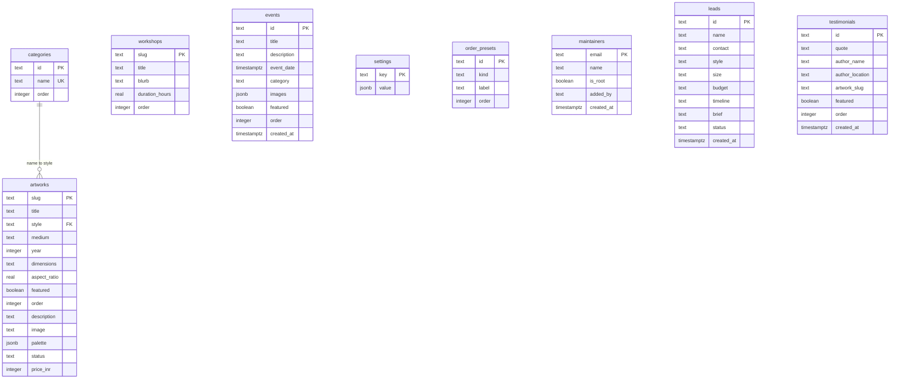

# Database

Neon Postgres stores the catalog, events, settings, editable lookups, maintainer allowlist, leads, and testimonials. Drizzle defines the schema and queries. Public catalog reads go through [lib/data.ts](../lib/data.ts); private reads and mutations must also check current maintainer authorization. See [ARCHITECTURE.md](ARCHITECTURE.md), [AUTH.md](AUTH.md), and [IMAGES.md](IMAGES.md) for the other boundaries.

## Connection and environments

[lib/db/client.ts](../lib/db/client.ts) creates a module-level Drizzle client using the Neon HTTP driver. `DATABASE_URL` is read through [lib/env.ts](../lib/env.ts). Queries run over HTTP; a batch can execute atomically, but it cannot include an R2 operation in its database transaction.

Public pages read catalog data during build and regeneration. Normal cached page requests do not each query Neon. A missing database connection fails those real-data builds; it does not silently turn every page into a JSON-only page.

Keep production, preview, and developer databases separate. CI builds use `KALCHAR_TEST_FIXTURES=1` to supply deterministic public rows through the data seam, without production DB, R2, or OAuth secrets. Fixtures do not bypass admin authentication. Migration application is checked separately against disposable PostgreSQL. Never deploy fixture mode as the real catalog.

## Nine-table schema

[lib/db/schema.ts](../lib/db/schema.ts) is the authoritative schema. Generated SQL and snapshots in `drizzle/` record its history.



| Entity | Contract |
| --- | --- |
| `artworks` | `slug` identifies the page; `image` identifies the independently versioned stored image. Preserve the latter when generating URLs. Price is INR. The shared buy rule is a positive finite price and a status other than sold. |
| `categories` | `id` identifies the editable category; unique `name` is referenced by `artworks.style`. The foreign key cascades a rename and restricts deletion while pieces reference it. It closes races that application-only usage checks cannot prevent. |
| `workshops` | Sessions offered, ordered by `order` with a stable identity tie-breaker. These are distinct from events that already happened. |
| `events` | `images` is an ordered JSON array of R2 key-bases. The first is the cover. Updates must detect conflicts rather than overwrite a concurrently edited array. |
| `settings` | Singleton JSON values such as `profileImage` and the home-intro toggle. `catalogBootstrap` records successful one-time seeding and must not be removed to force reseeding. |
| `order_presets` | `kind` is size, budget, or timeline; `label` and `order` define each dropdown option. |
| `maintainers` | Normalized Google email allowlist. `is_root` prevents removal through the application. `added_by` is an audit label, not a foreign key. Root provisioning is separate from catalog seeding. |
| `leads` | Optional name and return-contact text, style/size/budget/timeline, required brief, triage status, and timestamp. Contact is limited to 200 characters. Treat all fields as personal data. |
| `testimonials` | Quote, author, optional location, featured flag, and sort order. `artwork_slug` is an optional text association, not an enforced foreign key. |

Database checks reject invalid lifecycle/triage/preset values, blank required text, and nonpositive prices, dimensions, and order values. Application validation supplies understandable feedback; constraints also protect writes that bypass the UI.

Before applying the category relationship migration to an existing database, inspect duplicate category names and artwork styles without a matching category. Resolve those rows deliberately in a preview branch, preserving their intended category. Do not silently delete catalog records to make a constraint pass.

## Data and cache boundaries

Catalog getters map nullable database fields to the UI types. Shared sale rules live in [lib/catalog.ts](../lib/catalog.ts). [Setting parsers](../lib/site-settings.ts) validate stored profile-image and home-intro values before returning them; callers cannot assert an arbitrary type over JSON. `getSite()` remains synchronous and reads bundled brand/nav/copy from `data/site.json`; changing that JSON requires a new build.

| Read group | Consumers |
| --- | --- |
| Artwork collection, available/featured pieces, slug lookup | Home, gallery, detail pages, metadata, feed, sitemap |
| Categories and style samples | Gallery filters, custom-order examples, admin options |
| Workshops and order presets | Public offerings, inquiry form, admin editors |
| Events and profile settings | Home, event/about pages, corresponding admin editors |
| Testimonials | Home and artwork details |
| Leads and maintainer roster | Authorized private admin reads only |

Public cache invalidation must cover these consumers, including custom-order image examples and every detail page's previous/next links after reorder or deletion. A layout-level invalidation or a complete dependency map is necessary; invalidating only `/work` does not automatically invalidate each detail path.

## Fresh database setup

Use migrations for every database intended to survive beyond an experiment:

```sh
node scripts/check-migrations.mjs
pnpm db:migrate
pnpm db:seed
```

`db:migrate` loads the configured environment through `drizzle.config.ts` and applies the committed journal in order. Confirm the target is the intended isolated database before running any write command. Catalog seeding is optional for an empty production catalog; it is intended for original seed/bootstrap environments.

`db:push` is for throwaway schema experiments only. Do not push the latest schema and then replay the complete migration history: unconditional table creation and constraints in earlier migrations can already exist. An existing pushed database needs the baseline procedure below.

For a schema change:

1. Edit the schema and generate SQL with `pnpm db:generate`.
2. Review SQL, snapshot, and journal together. Keep older migrations unchanged.
3. Run `node scripts/check-migrations.mjs`. It rejects missing/orphaned SQL or snapshots, invalid numbering, duplicate/out-of-order timestamps, and broken snapshot ancestry.
4. Apply the journal to fresh disposable PostgreSQL and to a representative preview branch.
5. Verify behavior before applying the reviewed migration to production under the release procedure.

File validation does not execute SQL or prove data compatibility. The disposable PostgreSQL check and preview migration exercise cover those different questions.

## Existing database created with db:push

Baseline only the migration prefix whose resulting schema is already present. Never label pending schema changes as applied just to silence a migration error.

The offline [prepare-migration-baseline.mjs](../scripts/prepare-migration-baseline.mjs) script compares two public schema dumps and generates history-only SQL. It never connects to a database or runs that SQL.

1. Pause schema/catalog writes and capture a coordinated backup per [OPERATIONS.md](OPERATIONS.md).
2. Choose the last already-present migration tag. Create an empty, disposable reference database and apply only the numbered SQL files through that tag, in journal order. For example, a database matching migration `0002_slow_sprite` needs `0000`, `0001`, and `0002`, not later pending migrations.
3. Use the same `pg_dump` executable/version to dump `public` from both the reference and target. Named libpq services below refer to externally managed credentials; no connection string belongs in this repo.

```sh
pg_dump --dbname=service=kalchar-reference --schema-only --schema=public --no-owner --no-acl --no-comments --no-security-labels --file=.cache/reference.sql
pg_dump --dbname=service=kalchar-target --schema-only --schema=public --no-owner --no-acl --no-comments --no-security-labels --file=.cache/target.sql
node scripts/prepare-migration-baseline.mjs --reference .cache/reference.sql --target .cache/target.sql --through 0002_slow_sprite --output .cache/baseline.sql
```

4. The script requires matching DDL and exactly the selected snapshot's public tables. It normalizes line endings and ignores only `pg_dump` version/time headers and per-run `psql` restriction tokens. Other text differences, including objects, defaults, constraints, and indexes, stop preparation. Reconcile differences explicitly and repeat the comparison. Do not remove statements from dumps to force a match.
5. Review the generated file. While the target remains write-frozen, apply it to the exact target used for the comparison:

```sh
psql --dbname=service=kalchar-target -X --set=ON_ERROR_STOP=1 --file=.cache/baseline.sql
```

6. The SQL locks migration history, requires any existing history to be an exact prefix, and inserts only missing hashes/timestamps. It does not replay application DDL or data changes. Then apply genuinely pending migrations normally.

Schema equality alone does not prove historical data-transform migrations ran. Inspect every selected SQL file for data changes or side effects and prove their postconditions separately before baselining them. The currently reviewed prefix through `0002` consists of schema changes.

Keep the schema dumps, chosen boundary, history SQL, and review evidence in the private operation record. This repository does not assert that a live database has been baselined.

## One-time catalog seed

[migrate-json-to-db.ts](../scripts/migrate-json-to-db.ts) inserts original artworks, workshops, categories, and size/budget/timeline presets. Categories are inserted before artworks so their foreign key is satisfied. It uses the same status derivation as the application.

The script locks catalog/content/settings tables and checks that they are empty in the same transaction as all inserts. Existing maintainers are allowed and unchanged. Any existing artwork, category, workshop, preset, event, testimonial, lead, or setting refuses the operation. A `catalogBootstrap` setting makes later reseeding refuse even if all original catalog pieces were deleted.

There are no conflict-update or conflict-do-nothing inserts. A failure rolls the transaction back. Seed data is not a synchronization system or a recovery substitute. Do not clear tables or remove the marker to repeat it on a used environment.

Inspect counts without loading `.env.local` or connecting to Neon:

```sh
pnpm exec tsx scripts/migrate-json-to-db.ts --dry-run
```

`pnpm db:images` is separate and writes R2 objects. It regenerates only the checked-in original masters, not later admin uploads. See [IMAGES.md](IMAGES.md) and [OPERATIONS.md](OPERATIONS.md).
